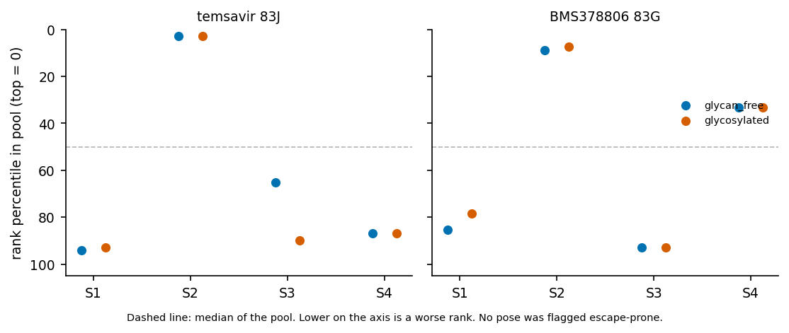
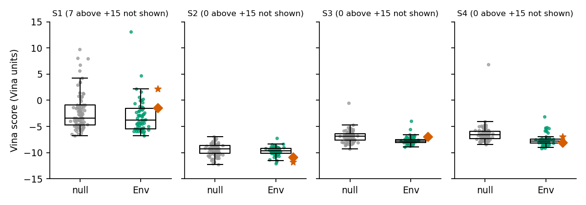
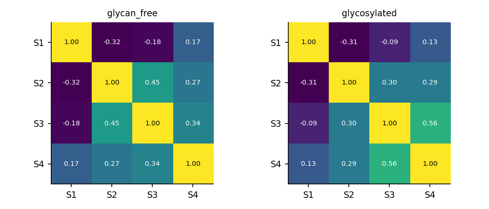
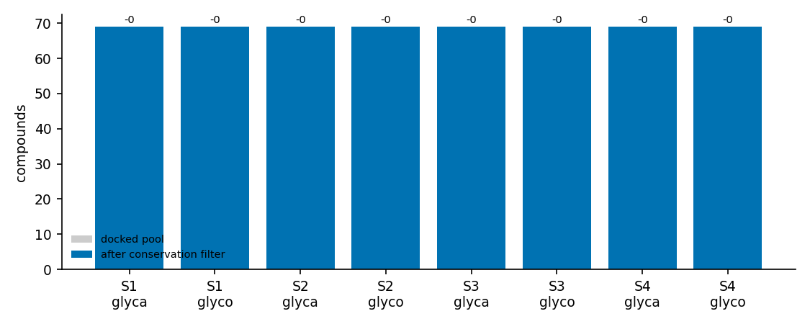
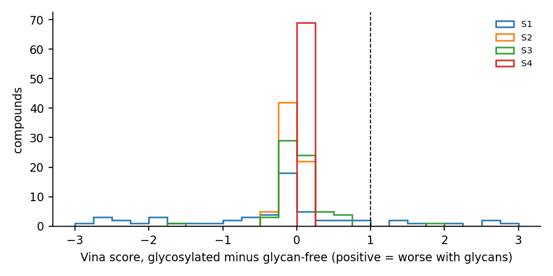

# Temsavir ranks 2nd of 69 against its own crystal receptor and 45th to 65th against every other HIV-1 Env state tested

Bench tier: A. No wet lab. Nothing in this repository was tested at a bench, and nothing in it is a claim about treating or preventing HIV infection in a person.

## Summary

I set out to rank four kinds of molecule (small molecules, peptides, designed protein binders and aptamers) against the HIV-1 envelope trimer. Only the small molecules got ranked. The other three arms need stages of my roadmap that I never ran, so they have no candidates, and I have written up why in `results/modality_*_not_run.md` instead of filling them with a table.

The small-molecule arm docked 69 Env-directed compounds (67 candidates from ChEMBL plus temsavir and BMS-378806 as positive controls) and 97 property-matched random molecules into the temsavir pocket of four deposited Env structures, each with and without the glycans the deposition resolved. That is 1,328 AutoDock Vina runs (`results/dock_scores.tsv`). Temsavir ranked 2nd of 69 in 5U7O, the structure it was crystallised in, and 64th of 69 in the closed trimer without the ligand (4TVP), 62nd in the CD4-bound open trimer 6U0L and 60th in the CD4-bound trimer 8Z7N (glycosylated arm, `results/control_ranks.tsv`). Its median rank percentile across the four states is 88.4, in the bottom half. BMS-378806 ranked 5th in 5U7O and had a median percentile of 55.8. The Vina score separates the Env-directed set from random molecules with an AUC of 0.57 in 5U7O, 0.78 in 6U0L and 0.81 in 8Z7N (`results/null_floor.tsv`), and its correlation with ChEMBL potency is close to zero in every state. The conservation filter removed 0 of 1,328 poses. On the evidence here I would not spend money on any modality yet. If forced to order from this ranking, the 17 compounds in `results/order_list.tsv` cost a placeholder $5,610 and 204 bench hours, and the pre-registration states what result would refute them.

## Background

Env is the trimeric HIV-1 spike, three gp120 and three gp41 chains. It is a conformational machine. Single-molecule FRET on virions resolved several pre-fusion states (Munro et al., Science 2014, 346:759-763), and Lu et al. (Nature 2019, 568:415-419) compared those states with solved structures. As I understand their conclusion, the solved high-resolution structures sit in the downstream States 2 and 3, and no structure of State 1 has been determined. I have not re-read that comparison for this repository, and I did not check whether a State 1 structure has been deposited since 2019. Every receptor here is therefore a conformation the virion mostly does not present, and the state most often presented is absent from the panel.

About half the mass of Env is N-linked glycan. Deposited structures model few of those sugars, and most docking preparation strips what is there. A compound can look good against the bare protein surface and be sterically excluded on a real virion.

Env is also among the most variable proteins known. A compound whose contacts sit in V1, V2 or V3 escapes quickly whatever its score.

Docking scores from different modalities are different quantities and cannot be pooled. This repository ranks within one modality. Breadth across a strain panel matters more than potency on one strain, and this run has no breadth data, since no assay and no CATNAP test were run.

The pocket in question is the one temsavir occupies in 5U7O. It is induced: the closed, unliganded trimer does not hold it open in the same way, which makes it a hard docking target.

## Data

Structures, read from RCSB on 2026-09-29 (`logs/02_fetch.json`, `config/panel.tsv`):

| State | Entry | Resolution (A) | Deposited | Method | Clade | Content |
|---|---|---|---|---|---|---|
| S1 | 4TVP | 3.1 | 2014-06-27 | X-ray | A (BG505) | closed, no pocket ligand |
| S2 | 5U7O | 3.031 | 2016-12-12 | X-ray | A (BG505) | closed, temsavir (CCD 83J) bound |
| S3 | 6U0L | 3.3 | 2019-08-14 | cryo-EM | A (BG505) | asymmetrically open, CD4 and E51 bound |
| S4 | 8Z7N | 3.58 | 2024-04-20 | cryo-EM | CRF07_BC, unverified | intermediate open, CD4 bound, strain CH119 |

5U7M (BMS-378806, CCD 83G, 3.025 A, 2016-12-12) was downloaded and its ligand was used as the second control, but it is not a panel state. The clade of 8Z7N is not a database field. I took it from the deposition title ("Asia CRFs") and the strain name, and it needs checking. The 6U0L clade follows its BG505 title. No State 1 structure is in the panel. The CD4-bound and different-clade entries were chosen by my own RCSB full-text query ("HIV-1 envelope trimer CD4 bound", resolution at most 4.0 A, at least three protein entities), which returned 10 entries; I picked 6U0L and 8Z7N from them by title.

Databases, all pulled on 2026-09-29:

| Source | What | Count |
|---|---|---|
| ChEMBL_37 | activity rows for 8 targets annotated to HIV-1 Env or gp160 | 680 rows, 564 molecules |
| UniProt | non-fragment env sequences, 600 to 900 residues | 3,361 |
| RCSB | 5 entries | see above |

No Los Alamos alignment and no CATNAP export was downloaded. Both come from web forms.

ChEMBL's Env annotation is noisy: reverse transcriptase and integrase compounds sit under gp160 targets. Of the 564 molecules, 491 were excluded (`results/excluded_candidates.tsv`): 476 because their source paper is not on the include list in `config/candidate_sources.tsv`, and 15 for more than 55 heavy atoms or MW above 700. That left 73 molecules, which collapsed to 70 unique structures by the connectivity layer of the InChIKey: 68 candidates and the two controls, both of which were already in ChEMBL. The CCD entries for 83J and 83G supplied the control SMILES. Two molecules then failed ligand preparation, one candidate (C0089, Meeko error) and one null (C0036, embedding failure), leaving 69 in the Env pool and 97 in the null.

The null is 97 molecules drawn at random from ChEMBL (300 to 600 Da, at most one Lipinski violation, seed 20260929, 3,014 in the sampling pool), matched to the pool's heavy-atom histogram in 5-atom bins.

Earlier roadmap stages, with the commit read on 2026-09-29: stage 1 `vina_gnina_pose_benchmark_pipeline` at 313851a, stage 2 `colabfold_boltz_structure_confidence_pipeline` at ed49138, stage 4 `vina_litpcba_virtual_screening_pipeline` at dc95aaa. Stages 3, 5 and 6 and the stage 4 peptide arm were never run. Only stage 1's preparation conventions were followed. No code was vendored from any of them, so the stage 1 conventions were followed by hand and not imported. The reason is in `scripts/06_dock.py`. Stage 4 is calibrated on 15 non-Env targets and holds no Env compounds, so it could not supply candidates. `data/README.md` has the provenance table.

## Pipeline

Commands in order, from the repository root. The environment is the base Python of the machine (versions in `logs/01_install.versions.tsv`: Python 3.13.11, RDKit 2025.03.6, Meeko 0.7.1, GEMMI 0.7.5, Biopython 1.86, Open Babel 2.4.1, AutoDock Vina 1.2.7).

```
bash scripts/00_configure.sh --threads 16 --ram 16 --disk 1.5 --tier A --jobs 2 --n-candidates 168 --n-states 4 --yes
bash run_all.sh --from 1
```

00, configure. Writes `project.conf`, projects disk use and refuses to start if the projection exceeds the budget. The budget was 1.5 GB because the machine had about 2 GB free. Jobs were 2, because each Vina process peaked near 0.45 GB resident and free memory was about 1 GB.

02, fetch. Structures, ChEMBL export and UniProt sequences with dates and SHA-256 hashes (123 s, `logs/02_fetch.json`).

03, conformer panel. The box centre is the centroid of temsavir in 5U7O, moved into each other state by a C-alpha superposition of the gp120 protomer. The alternative, residue numbers, breaks on the CH119 strain. The superposition RMSD is 0.71 A for 4TVP, 4.49 A for 6U0L and 6.55 A for 8Z7N over 444, 364 and 307 aligned C-alpha atoms, so the box in the two open states is placed only approximately.

04, receptors. Env chains only, from the biological assembly (three protomers), cropped to residues within 24 A of the box centre, hydrogens and charges from Open Babel 2.4.1. CD4 and Fabs are removed in every state. This stage had a bug that cost about 9 hours of docking. Ligands, sulfate, waters and Asn-linked NAG residues sit inside the polymer chains in these depositions, and the first version kept them. Temsavir was in its own docking pocket in S2. The crystal ligand redocked to a score of +32, which is what exposed it. Every S1 to S3 score from that first pass was discarded (kept for the record in `results/superseded_first_run_dock_scores_S1_S3.tsv`) and S4, whose receptor was unchanged, was kept.

05, candidates. Anonymous shuffled ids. The docking code reads only `data/candidates/candidates.tsv`. Roles (control, candidate, null) sit in a separate file read by stages 11 to 14, so the controls go through the same functions as every other molecule.

06, docking. AutoDock Vina 1.2.7, default Vina scoring function, 18 A cubic box, exhaustiveness 6, seed 42 for every run, one CPU per process, two processes at once. The first attempt with a 22 A box and exhaustiveness 8 was stopped after 27 dockings because ligands of 40 heavy atoms took 70 to 280 s each, which projected to about 15 hours. The measured projection on the first ten candidates was 5.2 h (`logs/06_projection.json`). The real cost was far higher because those ten were small. Exhaustiveness 6 was chosen to fit the time, and there is no evidence that it converges in an induced pocket.

07, 08, 09. Peptide, binder and aptamer arms. They write their not-run notes and nothing else.

10, conservation. Each UniProt sequence was aligned to the BG505 reference by local pairwise alignment (BLOSUM62), and per-position Shannon entropy was read off the columns (570 reference positions, median entropy 0.311 bits). This is weaker than a curated Los Alamos multiple alignment, because pairwise alignment misplaces residues in V1 and V2. Contacts are receptor residues within 4.5 A of the top pose. A contact is hypervariable above the 75th percentile of entropy (1.143 bits). A pose is escape-prone if any contact lies in V1 (131 to 157), V2 (158 to 196) or V3 (296 to 331), or if a third of its contacts are hypervariable. The 75th percentile and the third are arbitrary and were fixed by eye before any candidate was examined.

11, ranking. Rank 1 is the lowest Vina score. Percentile is rank divided by pool size. The null is outside the pool.

12, holdout. The CATNAP and panel-coverage tests I had planned belong to the binder arm and were not run (`results/holdout_not_run.md`). Two smaller tests were run: score against ChEMBL potency, and redocking of the temsavir crystal pose.

13, pre-registration, committed alone as `d9168e7`. 14, analysis. 15, figures. 17, assay ingestion: it refuses at tier A.

## Results

### What a Vina score is

The number in every table is the output of the Vina scoring function (AutoDock Vina 1.2.7), an empirical function fitted to a training set of protein-ligand complexes. Vina prints it in units labelled kcal/mol. It is neither a free energy nor an affinity, and it is used here only to order molecules. It does not license a statement about how strongly anything binds, how well it would neutralise virus, or what would happen in a person.

### Positive controls

**Temsavir ranked 2nd of 69 against the receptor it was crystallised in and in the bottom half against every other state.**



Rank in the pool of 69 (glycosylated arm, `results/control_ranks.tsv`; glycan-free ranks differ by at most 17 places and are in the file):

| Control | S1 4TVP | S2 5U7O | S3 6U0L | S4 8Z7N | Median percentile |
|---|---|---|---|---|---|
| Temsavir | 64 | 2 | 62 | 60 | 88.4 |
| BMS-378806 | 54 | 5 | 64 | 23 | 55.8 |

The 5U7O result is the easy case: the receptor carries a pocket shaped by temsavir itself. Temsavir's crystal pose redocked to within 1.13 A of the crystal centroid, with 79 percent of its 58 crystal heavy atoms within 2 A of a pose atom (`results/redock_temsavir_S2.tsv`). That is a check that the box and preparation work. It is not a ranking result.

The 5U7O pocket is also permissive. Of 332 dockings in S2, 232 scored below -9, against 0 in S1. Random molecules score almost as well there: median Vina score -9.27 for the null and -9.68 for the pool, glycosylated arm (`results/null_floor.tsv`). Temsavir's score of -11.8 is better than 96.9 percent of the null molecules in S2, so it stands out even in this permissive pocket.

In the closed trimer without the ligand, 65 of 332 scores are positive, which is what a shut pocket looks like to Vina.

### Null floor

**The Env-directed set separates from random molecules in the open states and barely at all in the closed ones.**



AUC is the probability that a random pool member scores lower than a random null molecule (95 percent bootstrap interval), glycosylated arm: S1 0.576 (0.486 to 0.660), S2 0.572 (0.494 to 0.655), S3 0.781 (0.698 to 0.849), S4 0.808 (0.721 to 0.879).

Vina scores depend on molecular size. Among the pool, Spearman's rho between score and heavy-atom count is 0.56 in S1, -0.54 in S2, -0.15 in S3 and 0.11 in S4. The null was matched to the pool's heavy-atom histogram, so the AUC is not a size effect by construction. The median heavy-atom count of the ten compounds in the order list is 25.5 against 24.0 for the pool.

Among the 69 pool members that carry a ChEMBL potency, Spearman's rho between score and -log10 potency in nM runs from -0.113 to 0.177 across the eight state and arm combinations, and from -0.100 to 0.175 after removing the trend with heavy atoms (`results/potency_association.tsv`). The potencies come from several assay types, so this is a rough test, and it says the score carries no detectable potency ordering within the set.

### Conformational states

**The ordering of compounds changes with the state, to the point of disagreeing.**



Spearman correlation between states, glycosylated arm (`results/state_rank_correlation.tsv`): S1 with S2 -0.31, S1 with S3 -0.09, S1 with S4 0.13, S2 with S3 0.30, S2 with S4 0.29, S3 with S4 0.56. Of the 69 pool members, 20 were in the top decile in one state and in the bottom half in another (18 in the glycan-free arm). The rank of those compounds is an artefact of the state chosen. The two open states, S3 and S4, agree best, and they are the structures that differ from each other by clade and by cryo-EM map.

### Funnels

**The conservation filter removed nothing.**



Per state and arm, 69 of 69 pool compounds and 97 of 97 null molecules passed the conservation filter (`results/funnel.tsv`). Poses have a median of 17 contact residues (range 6 to 30). No contact in any of the 1,328 poses lies in V1, V2 or V3, and the hypervariable-fraction rule never fired (`results/conservation_contacts.tsv`). The pocket is conserved by the measure used here, and the measure is crude, so a filter that removed nothing is weak evidence about escape and stronger evidence about how little the pairwise-alignment entropy discriminates in this region.

### Glycans

**Resolved glycans changed almost nothing in S2 and S3, and the S1 losses are not glycan contacts.**



No glycan modelling tool was run. The glycosylated arm keeps the sugars the deposition resolved inside the 24 A crop: 10 residues in S1, 10 in S2, 7 in S3 and 0 in S4 (`results/receptor_summary.json`). The glycan shield is therefore mostly absent from both arms. The two arms of S4 are identical receptors and gave identical scores.

By the arbitrary rule (score worse by more than 1.0 unit with glycans), 12 compounds are lost in S1, none in S2, 2 in S3 and none in S4 (`results/glycan_summary.tsv`). The S1 figures do not look like glycan sterics. No S1 top pose lies within 4.5 A of a glycan atom, yet 7 of the 12 lost compounds score positive in the glycosylated arm against 2 in the glycan-free arm, and the largest change is +170 units. I attribute this to search variability in a shut pocket, where the score is dominated by clashes with protein. I did not test that, and a repeat with a second Vina seed would. The only state where top poses contact a resolved glycan is S2 (27 poses). The median change across S2 compounds is -0.01 and the largest is 0.41 units.

### The CATNAP retrospective

Not run. See `results/holdout_not_run.md`.

## The pre-registration

`results/preregistration.md` was written by `scripts/13_prereg.py` and committed alone as `d9168e7` (`add_preregistration`) before any assay result exists or could exist, since there is no assay. It records the tree commit `4375bca8f9eeecc61f7d7742a3b9df654c7c5649`, the SHA-256 of 17 input files (all 17 still match the files on disk) and the date 2026-10-01. The commit hashes the pre-registration cites changed when the history was rewritten once before this repository was recreated, and `results/preregistration_correction.md` maps the old hashes to the new ones. The tables were written on Windows and carry CRLF line endings, and the hashes are of the files as committed, so a checkout that converts line endings will not reproduce them.

It names 17 compounds to order: the 10 best by median percentile across the four states in the glycosylated arm, excluding any escape-prone in two or more states (median percentiles 7.2 to 25.4), the two anchors, and 5 random null molecules as assay negatives. Support for the ranking is stated as: temsavir IC50 below 1 uM on BG505 (assay validity), at least 3 of 10 ranked compounds below 10 uM on BG505, and at most 1 of 5 nulls below 10 uM. Refutation is 0 of 10, or a hit rate among ranked compounds no higher than among nulls, or ranked compounds that neutralise BG505 and no virus from another clade. The thresholds are arbitrary. A refutation would say nothing about temsavir.

The anchor temsavir sits at a median percentile of 88.4 in this ranking, the bottom half. The ranking does not recover it outside the structure it was crystallised in, and that goes in front of any reader deciding whether the top ten are worth ordering.

Cost (`results/cost_model.tsv`): $330 and 12 bench hours per compound tested across four viruses, $5,610 and 204 hours for the 17. The unit costs in `config/cost_assumptions.tsv` are placeholders set by me, not quotes, and labour is left unpriced.

## Repository structure

```
config/        panel.tsv, boxes.json, candidate_sources.tsv, cost_assumptions.tsv, bench_tier.conf, env_analysis.yml
scripts/       00 to 17, lib.sh, see the pipeline section
run_all.sh     orchestrator, --from, --modality, --state, --tier, --jobs, --help
results/       tables, preregistration.md, order_list.tsv, modality_*_not_run.md
figures/       five figures reproduced above
data/          untracked except README.md; structures, receptors, ligands, poses
logs/          fetch record, tool versions, docking projection
```

## Usage

Total working disk measured: 19 MB in `data/`, 0.8 MB in `.git`. The run was made at tier A on a 16-core, 15.6 GB Windows machine with about 2 GB of free disk and no GPU. No step uses a GPU.

| Step | Measured time |
|---|---|
| fetch (02) | 123 s |
| receptors (04), candidates (05), conservation (10), ranking (11), analysis (14), figures (15) | not timed |
| docking (06) | 1,328 runs, median 21 to 79 s each by state and arm, 40.0 h summed over runs, two at a time |

Peak resident memory per Vina process was 445 MB at the median, 555 to 562 MB at the 95th percentile and 1,053 MB at the maximum (`results/timing_distributions.tsv`). The machine went to sleep during docking, so 21 runs report wall times above 1,000 s that include suspended time, and the timing distributions above are contaminated by that. `run_timed` could not record peak memory for whole stages because `/usr/bin/time` is absent on this machine (`logs/06_score_small_molecules.timing` reads NA).

`bash run_all.sh` has not been run end to end from a clean clone. Stages were run one at a time, several of them after fixes.

## Limitations

No State 1 structure exists, so the conformation the virion most often presents is absent from the panel. Four states is a small panel, and only S2 holds the pocket open.

The glycan shield was not modelled. Resolved sugars inside a 24 A crop are a handful of residues, so the glycosylated arm is close to the glycan-free arm and says little about steric occlusion on a virion.

Every receptor is a soluble trimer, cropped to a patch, with CD4 and antibodies removed. None is membrane-embedded Env. The 6U0L and 8Z7N boxes are placed by a whole-protomer superposition with 4.5 to 6.6 A RMSD and may sit off the true pocket. The ChEMBL set is curated by source-paper title, not by confirmed mechanism, and mixes CD4-mimetic compounds, which act at a neighbouring cavity, with attachment inhibitors, all docked into the temsavir box. The potencies are from heterogeneous assays. Exhaustiveness 6 and an 18 A box were chosen for time. The conservation alignment is pairwise UniProt sequences and not a Los Alamos alignment, and its clade mix was not measured. The first docking pass had a receptor bug (described above), which raises the question of what else in the preparation has not been checked: for instance, protonation was left to Open Babel at pH 7.4 and ligand protonation states were not assigned.

Only one modality was run. No cross-modality statement is made because there is nothing to compare. A single-round pseudovirus assay would not be infection, an entry inhibitor does nothing about the latent reservoir, and nothing here measures affinity or makes a therapeutic claim.

## Data availability

Source data are public: RCSB entries 4TVP, 5U7O, 5U7M, 6U0L and 8Z7N, ChEMBL_37, UniProt. Downloaded files are not in the repository. `results/` holds every table quoted above, the pre-registration and the order list. `data/README.md` records sources and dates.

## Citation and licence

Code is MIT (see `LICENSE`). Licences of the tools, databases and model files were not all checked for this run. Meeko 0.7.1 declares LGPL-2.1 in its package metadata (read 2026-10-01). The licences of AutoDock Vina, Open Babel, RDKit, GEMMI, Biopython, ChEMBL, UniProt and RCSB data were not checked on this run and should be before redistribution.

References, each confirmed against Crossref on 2026-10-01:

- Pancera M, Zhou T, Druz A, et al. Structure and immune recognition of trimeric pre-fusion HIV-1 Env. Nature 2014, 514:455-461. doi:10.1038/nature13808
- Pancera M, Lai YT, Bylund T, et al. Crystal structures of trimeric HIV envelope with entry inhibitors BMS-378806 and BMS-626529. Nat Chem Biol 2017, 13:1115-1122. doi:10.1038/nchembio.2460
- Munro JB, Gorman J, Ma X, et al. Conformational dynamics of single HIV-1 envelope trimers on the surface of native virions. Science 2014, 346:759-763. doi:10.1126/science.1254426
- Lu M, Ma X, Castillo-Menendez LR, et al. Associating HIV-1 envelope glycoprotein structures with states on the virus observed by smFRET. Nature 2019, 568:415-419. doi:10.1038/s41586-019-1101-y
- deCamp A, Hraber P, Bailer RT, et al. Global panel of HIV-1 Env reference strains for standardized assessments of vaccine-elicited neutralizing antibodies. J Virol 2014, 88:2489-2507. doi:10.1128/JVI.02853-13
- Sarzotti-Kelsoe M, Bailer RT, Turk E, et al. Optimization and validation of the TZM-bl assay for standardized assessments of neutralizing antibodies against HIV-1. J Immunol Methods 2014, 409:131-146. doi:10.1016/j.jim.2013.11.022
- Seaman MS, Janes H, Hawkins N, et al. Tiered categorization of a diverse panel of HIV-1 Env pseudoviruses for assessment of neutralizing antibodies. J Virol 2010, 84:1439-1452. doi:10.1128/jvi.02108-09
- Yoon H, Macke J, West AP Jr, et al. CATNAP: a tool to compile, analyze and tally neutralizing antibody panels. Nucleic Acids Res 2015, 43:W213-W219. doi:10.1093/nar/gkv404
- Gardner MR, Kattenhorn LM, Kondur HR, et al. AAV-expressed eCD4-Ig provides durable protection from multiple SHIV challenges. Nature 2015, 519:87-91. doi:10.1038/nature14264
- Eberhardt J, Santos-Martins D, Tillack AF, Forli S. AutoDock Vina 1.2.0: new docking methods, expanded force field, and Python bindings. J Chem Inf Model 2021, 61:3891-3898. doi:10.1021/acs.jcim.1c00203
- O'Boyle NM, Banck M, James CA, et al. Open Babel: an open chemical toolbox. J Cheminform 2011, 3:33. doi:10.1186/1758-2946-3-33
- Wojdyr M. GEMMI: a library for structural biology. J Open Source Softw 2022, 7:4200. doi:10.21105/joss.04200
- Cock PJA, Antao T, Chang JT, et al. Biopython: freely available Python tools for computational molecular biology and bioinformatics. Bioinformatics 2009, 25:1422-1423. doi:10.1093/bioinformatics/btp163

RDKit and Meeko are cited by name and version only. No paper for either was verified.
